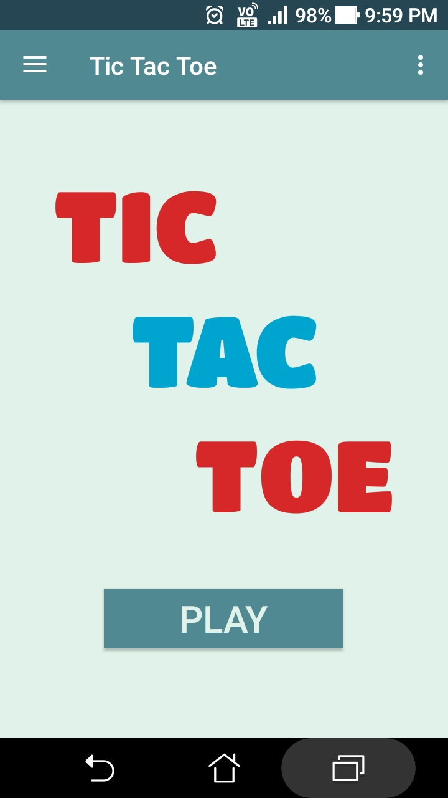
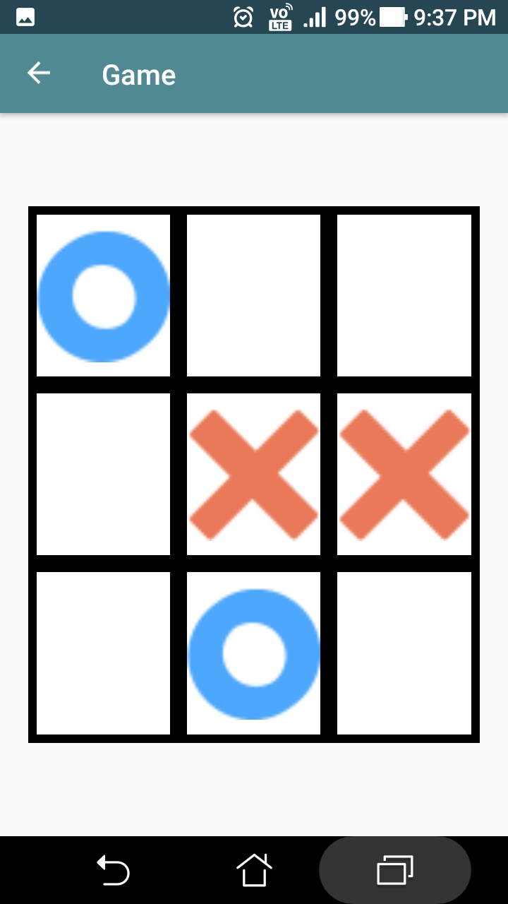
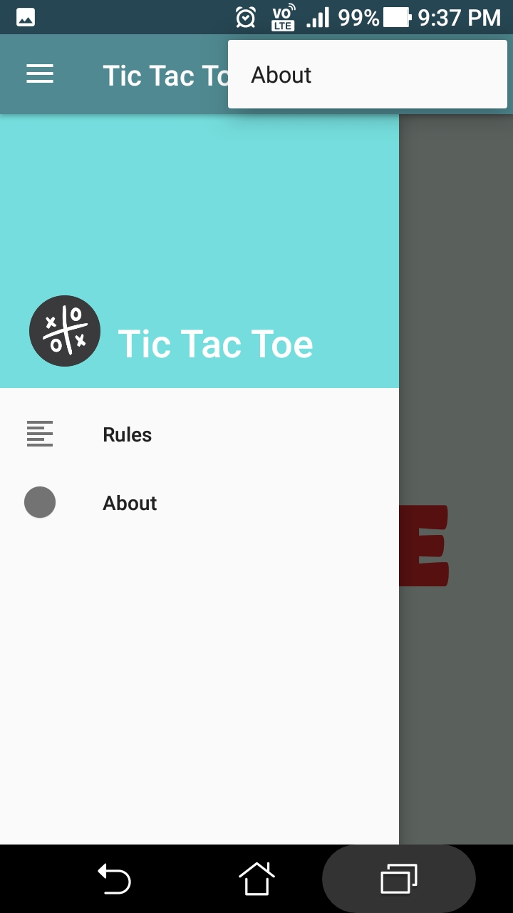
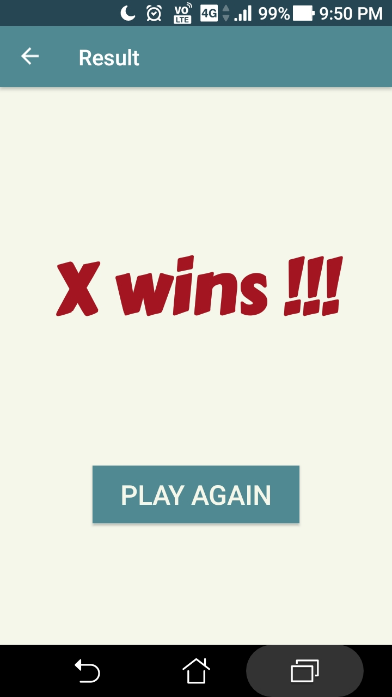
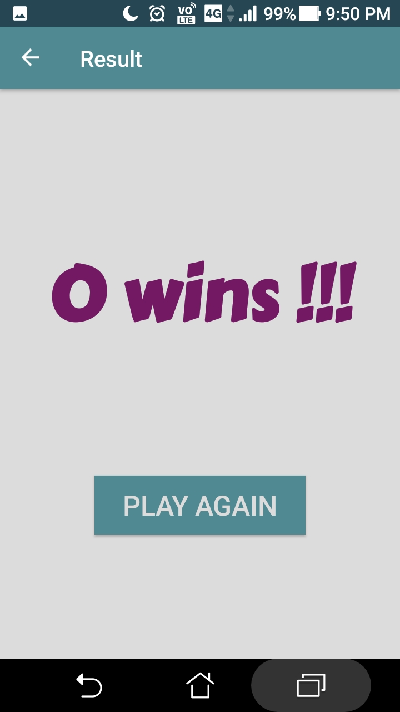
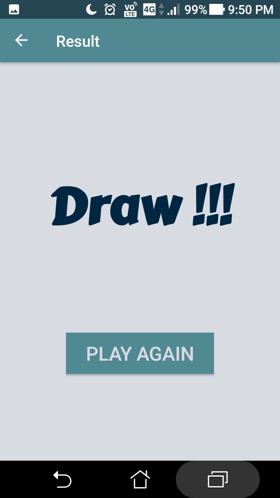

# TicTacToe
A multiplayer tic tac toe app implemented in kotlin. Some of the features implemented in the app are navigation drawer, menu and up button. Databinding is used to prevent the slowdown of app. Also 'Safe Args plugin' is used to pass data as arguments among fragments and thus reduce the number of fragments. 

# Overview

  
  
  
  
  
  

# Kotlin concepts implemented
1. **Data classes:** To store the strings and attributes for'Result' fragment (specifically text, text color and background color). Data classes along with fragment arguments forms the basis of attributes of 'Result' fragment. Thus, a single fragment is used to show the outcome of game instead of separate fragments.
2. **Lambda functions:** To reduce amount of code for some functions.
3. **Elvis operator and nullable variables along with null safety:** Elvis operator (?:) is used to assign values to fragment arguments if the game ends in a draw. 
4. **Unmutable lists:** Unmutable lists are used to store all the cells (buttons , Xs and Os) and a single click listener is used for all the views.
4. **Functions**
5. **Loops (if-else loop, for loop and when loop)**

# Contribute:
Contributions, issues and feature requests are welcome!

# Show your support:
Give a ⭐️ if you find this repo useful!
